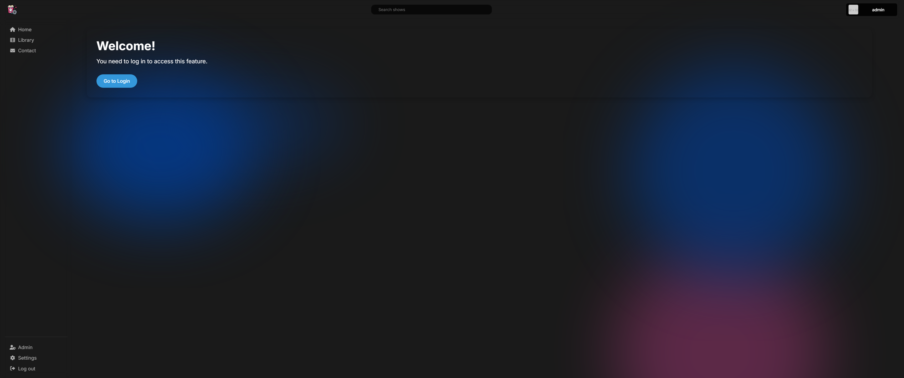
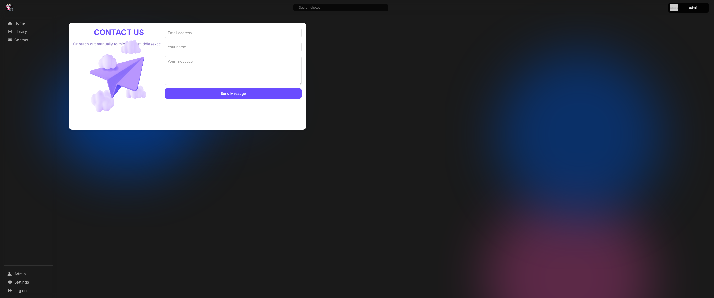
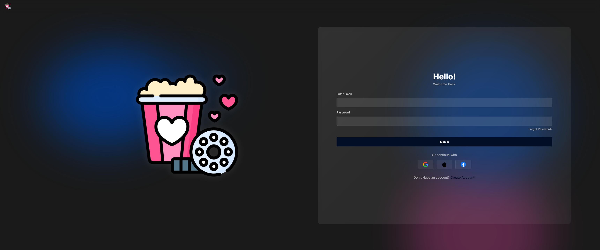
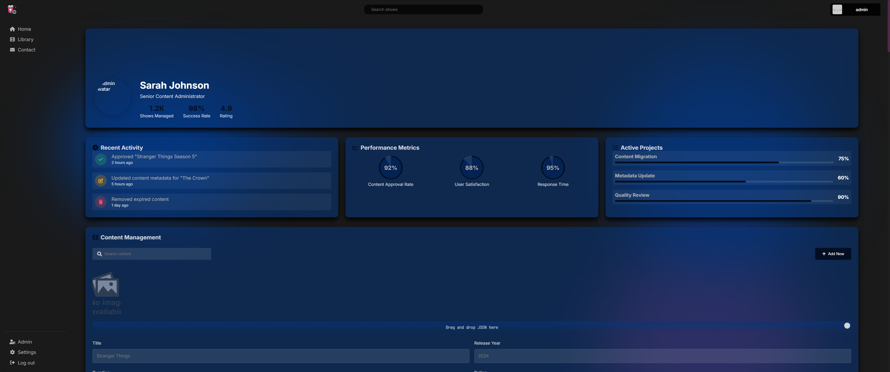
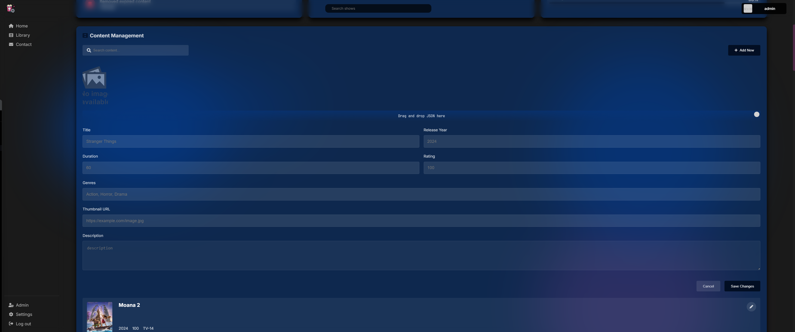
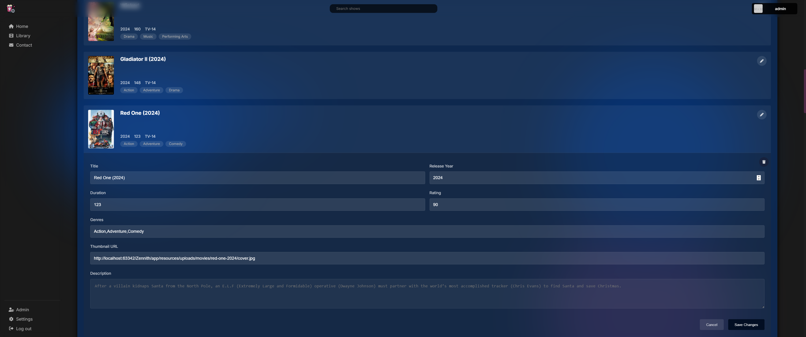

# Zennith

## Overview

Zennith is a dynamic and responsive web application developed as part of the **Web Development II** course project. The primary objective of the project is to create a website that enables users to manage a library system with the ability to add, delete, and update data stored in an SQL database. The project emphasizes both backend functionality and frontend responsiveness. Additionally, it includes an admin login feature for administrative control.

## Features

1. **User Authentication:**

    - User registration and login system.
    - Admin-specific login with the following credentials:
        - **Email:** `admin@gmail.com`
        - **Password:** (randomly generated; ensure it’s stored securely in the database).

2. **Library Management:**

    - Add, update, and delete books or other items in the library database.
    - Real-time feedback and responsive operations using JavaScript and PHP.

3. **Responsive Design:**

    - Fully optimized for various devices and screen sizes.
    - Ensures seamless user experience on mobile, tablet, and desktop devices.

4. **Modular Pages:**

    - Organized into multiple pages for better maintainability and scalability.
    - Includes dedicated sections for users, contact information, and administrative profiles.

5. **SQL Database Integration:**

    - Manages all user data, library items, and administrative controls efficiently.
    - Ensures robust operations with error handling and validation.

---

## File Structure and Screenshots

The project consists of several key pages, each contributing to the functionality of the application. Below is a detailed list of the pages along with placeholders for their screenshots:

### 1. `public/index.php`

- **Description:** The landing page of the website.
- **Features:**
    - Overview of the library.
    - Call-to-action buttons for login and browsing the library.

### 2. `public/pages/library.php`

- **Description:** Displays the list of books/items in the library.
- **Features:**
    - Search and filter options.
    - Add, edit, and delete items functionality.

### 3. `public/pages/contact.php`

- **Description:** Contact form for user inquiries.
- **Features:**
    - Fields for name, email, and message.
    - Validations and submission handling.

### 4. `public/pages/users/login.php`

- **Description:** User login page.
- **Features:**
    - Secure login form.
    - Redirection to user or admin profile based on credentials.
      

### 5. `public/pages/users/register.php`

- **Description:** User registration page.
- **Features:**
    - Form fields for user details.
    - Integration with the SQL database for account creation.

### 6. `public/pages/team/user/profile.php`

- **Description:** User profile page.
- **Features:**
    - Displays user-specific information.
    - Options to edit profile or logout.
- **Screenshot:** (No screenshot available at the moment)

### 7. `public/pages/team/admin/profile.php`

- **Description:** Admin profile page.
- **Features:**
    - Administrative tools for managing the library and users.
    - Enhanced control and dashboard features.

---

## Technologies Used

- **Frontend:**

    - HTML, CSS, JavaScript
    - Responsive design using modern techniques.

- **Backend:**

    - PHP for server-side scripting.
    - SQL for database operations.

- **Other Tools:**

    - Fetch API for AJAX calls.
    - Session management for authentication.

---

## Deployment

Zennith was locally run with Jetbrains `PhpStorm`. Using PHP version 8.0.2 and Mysql Server for server-side storage.

---

## Contribution and Development

- Developed as a solo project for **Web Development II**.

---

## Future Improvements

1. Enhanced security measures, including encryption for sensitive data.
2. More robust error handling and user feedback.
3. Integration with external APIs for extended functionality.

---

## Contact

For inquiries or suggestions, feel free to contact the project team through the contact page or via email.

<a href="mailto:michael.20.reuben@gmail.com" style="background-color: gray; border-radius: 3px; padding: 2px 5px; color: black; font-family: 'Jetbrains Mono Semibold', Inter, sans-serif; text-decoration: none; cursor: pointer">michael.20.reuben\@gmail.com</a>

